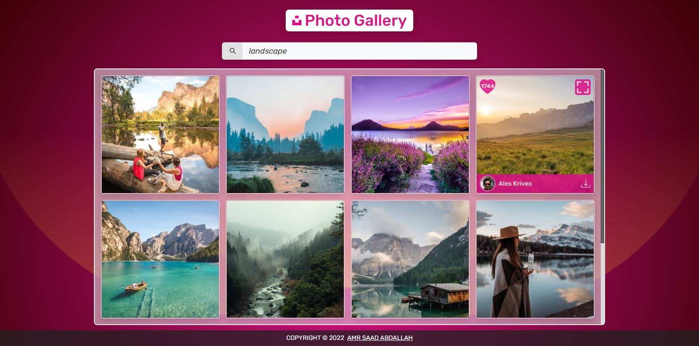
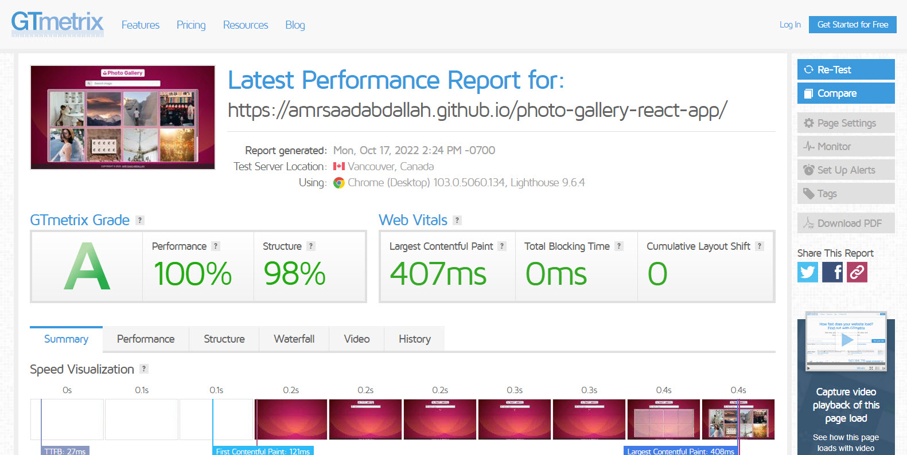

<h1 align="center" >Photo Gallery &mdash; React App</h1>

### 👁️ Project Preview:

- [ Live Preview 👉 https://amrsaadabdallah.github.io/photo-gallery-react-app](https://amrsaadabdallah.github.io/photo-gallery-react-app)

- [ Github Repo 👉 https://github.com/amrsaadabdallah/my-photo-gallery-react-app](https://github.com/amrsaadabdallah/my-photo-gallery-react-app)
    - 🚩 It's a private repo <a target="_blank" href="mailto:amrsaadabdallah@gmail.com">contact me </a>to see.

---

### 📝 Project Description & features:

- It's a medium react app (Photo Gallery) used to practice react features.

- I use [Unsplash Image API | Free HD Photo API](https://unsplash.com/developers) which has a largest open collection of high-quality photos.

- The first API URL (`https://api.unsplash.com/search/photos?client_id=${ACCESS_KEY}&page=${page}&query=${search}`) => used to fetch random  photos.

- The second API URL (`https://api.unsplash.com/photos/?client_id=${ACCESS_KEY}&page=${page}`) => used to fetch photos of entered word.

- When page load it's fetch random photos by using the first API Url, when scroll inside photos preview will fetch another photos.

with default search Info (searchWord: "",   currentPageNumber: 0)

- News pages pagination handles with backend  by fetching the news page by the selected page number.

- It's allowed to get photos related to a specific topic by entering it in the input field in this case will using the second API Url and when scroll inside photos preview will fetch another photos.

- When hover on any photo will preview info about it like the photographer (name, account) and number of photo likes, ability to download it and also allow to preview photo in screen full mode within a model.

---

### 🛠️ Project Tools:

1. Used Google Fonts.

1. Bootstrap Classes for styling.

1. ReactJS Library.

1. [Unsplash Image API | Free HD Photo API](https://unsplash.com/developers).

1. PropTypes package for typechecking component props.

1. Random paragraphs list get from local file called data.

1. [GTmetrix](https://gtmetrix.com/) is an online tool for customers to easily test the performance of their webpages.

---

### :sparkles: Project Skills applied:

1. Create Multiple React Component.

1. Configuration react component by props.

1. Render List of items.

1. Apply Conditional Rendering.

1. Deal with form.

1. Fetching Photos from [Unsplash Image API | Free HD Photo API](https://unsplash.com/developers).

1. Use React Hook (UseReducer, UseState, useEffect).

1. Ability to another page photos by using [infinite scroll](https://blog.saeloun.com/2022/07/08/react-custom-infinite-scroll-with-pagination.html).

1. Typechecking component props With PropTypes package.

1. Test the performance of the webpage after deploy by using [GTmetrix](https://gtmetrix.com/).

---

### 🧪 Project performance test:

Test the performance of the webpage after deploy by using [GTmetrix](https://gtmetrix.com/).

---

### 👋 Get In Touch:

- [🌐 Website 👉 https://amrsaadabdallah.github.io](https://amrsaadabdallah.github.io)
- [👔 LinkedIn 👉 https://www.linkedin.com/in/amrsaadabdallah](https://www.linkedin.com/in/amrsaadabdallah)
- [🌟 Github 👉 https://github.com/amrsaadabdallah](https://github.com/amrsaadabdallah)
- [📧 Gmail 👉 amrsaadabdallah@gmail.com](mailto:amrsaadabdallah@gmail.com)
- [🐤 Twitter 👉 https://twitter.com/amrsaadabdallah](https://twitter.com/amrsaadabdallah)
- [:phone: Whatsapp 👉 (+20) 109-775-6067](https://api.whatsapp.com/send/?phone=%2B2001097756067&text&type=phone_number&app_absent=0)

---

<a target="_blank" href="https://amrsaadabdallah.github.io">

 2022 &copy; Amr Saad Abdallah 

</a>

